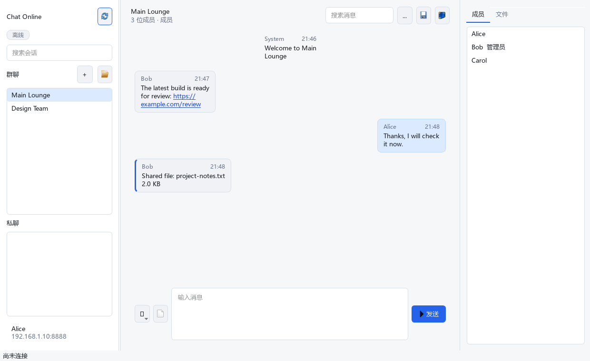
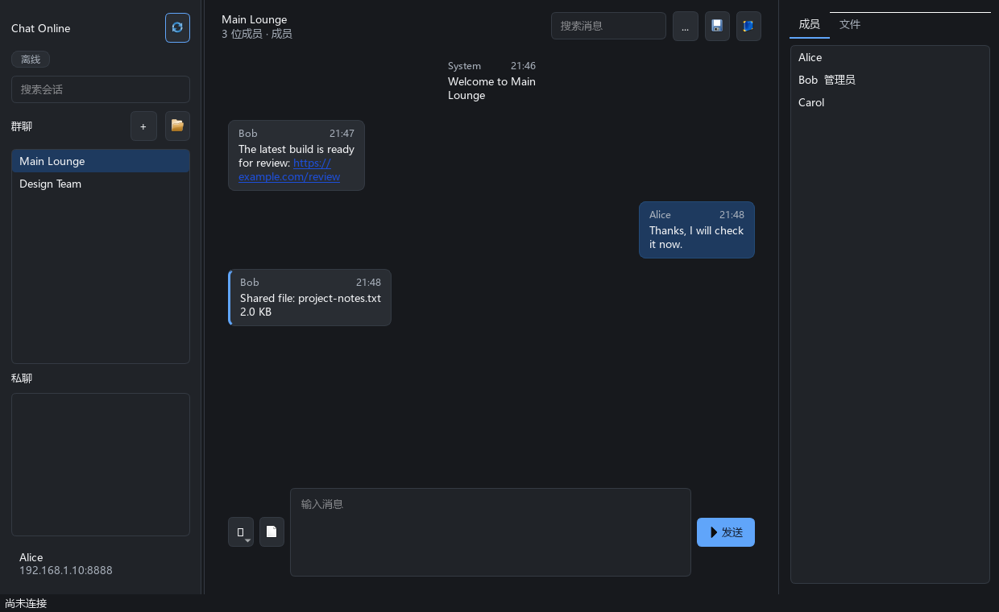
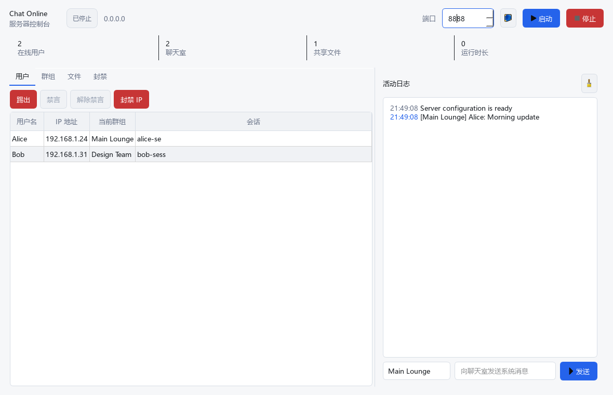

# Chat Online

基于 PyQt6 的局域网即时通信工具。一个程序同时提供聊天客户端、可视化服务器控制台和无界面服务器 CLI，适合家庭、教室、实验室与小型团队在可信局域网中快速建立聊天室。

`6.0.0` · `Python 3.10+` · `PyQt6` · `MIT`

<p align="center">
  
  
</p>

<details>
<summary>查看服务器控制台</summary>



</details>

## 功能概览

### 聊天客户端

- 主群、邀请码群组和一对一私聊
- 历史消息、在线成员、角色与禁言状态
- 文件上传、共享列表和下载，单文件最大 8 MiB
- 消息搜索、当前会话导出、输入状态提示
- 断线检测、自动重连和内存中的离线消息队列
- 亮色/暗色主题，窗口布局与最近连接信息自动保存
- URL 识别、可点击链接和常用表情

### 服务器控制台

- 启动、停止与运行状态监控
- 在线用户、群组、共享文件和活动日志集中查看
- 踢出用户、群组禁言/解禁、群组重命名与删除
- 单 IP 或 CIDR 网段封禁
- 向指定群组发送服务器公告
- 文件另存与删除、运行时长和资源统计

### 可靠性与数据保护

- UTF-8 JSON Lines 协议，正确处理 TCP 拆包与粘包
- 所有网络线程通过 Qt 信号更新界面，不直接操作 QWidget
- 消息帧、用户名、群名、正文和附件均有明确大小限制
- 历史文件与附件使用哈希文件名，阻止路径穿越
- 附件写入采用原子替换，并通过 SHA-256 校验完整性
- 数据写入用户数据目录，不依赖程序目录可写权限

## 30 秒开始使用

### 1. 安装

```powershell
py -m pip install -r requirements.txt
```

Linux/macOS 可将下文的 `py` 替换为 `python3`。

### 2. 打开程序

```powershell
py 聊天.py
```

启动器中选择运行模式：

- 服务器：设置监听端口并打开控制台。
- 客户端：填写服务器局域网 IP、端口和用户名。

客户端连接其他设备时应填写服务器的局域网 IPv4 地址，例如 `192.168.1.10`；`127.0.0.1` 只表示当前设备。

### 3. 直接启动指定模式

服务器控制台：

```powershell
py 聊天.py --mode server --host 0.0.0.0 --port 8888
```

客户端：

```powershell
py 聊天.py --mode client --host 192.168.1.10 --port 8888 --username Alice
```

也可以使用模块入口：

```powershell
py -m chat_online --help
```

## 安装为命令

```powershell
py -m pip install -e .
chat-online --version
```

安装后，`chat-online`、`py -m chat_online` 与 `py 聊天.py` 使用同一套入口。

## 无界面服务器

不需要桌面环境时，可运行 headless 服务器：

```powershell
py 聊天.py --mode server --headless --host 0.0.0.0 --port 8888
```

交互终端命令：

| 命令 | 作用 |
| --- | --- |
| `help [command]` | 显示命令列表或指定命令的帮助 |
| `status` | 查看监听地址、运行时长和资源数量 |
| `users` | 列出在线用户 |
| `rooms` | 列出群组 |
| `files [room]` | 列出全部或指定群组的共享文件 |
| `say <text>` | 向主群发送服务器公告 |
| `kick <username-or-id>` | 断开指定用户 |
| `mute <user> [room]` | 在指定群组禁言用户 |
| `unmute <user> [room]` | 解除群组禁言 |
| `ban <ip-or-cidr>` | 封禁 IP 或网段 |
| `unban <ip-or-cidr>` | 解除 IP 或网段封禁 |
| `stop` | 优雅停止服务器 |

参数支持 shell 引号，例如：

```text
say "Server maintenance in 10 minutes"
```

非交互式运行时不会读取标准输入，可使用 `Ctrl+C`、`SIGINT` 或 `SIGTERM` 优雅退出。

## 启动参数

| 参数 | 说明 |
| --- | --- |
| `--mode server\|client` | 直接进入服务器或客户端模式 |
| `--host HOST` | 客户端服务器地址，或服务器监听地址 |
| `--port PORT` | TCP 端口，默认 `8888`；服务器可用 `0` 自动分配测试端口 |
| `--username NAME` | 客户端用户名；省略时使用系统账户名 |
| `--theme light\|dark` | 指定亮色或暗色主题 |
| `--data-dir PATH` | 覆盖应用数据目录 |
| `--headless` | 无图形界面运行服务器，必须配合 `--mode server` |
| `--no-auto-start` | 打开窗口但不立即监听或连接 |
| `--reset-settings` | 清除保存的主题、窗口与连接设置 |
| `--version` | 输出版本号 |

查看当前版本的完整帮助：

```powershell
py 聊天.py --help
```

## 数据目录

默认数据位置：

| 系统 | 路径 |
| --- | --- |
| Windows | `%LOCALAPPDATA%\Chat Online` |
| macOS | `~/Library/Application Support/Chat Online` |
| Linux | `$XDG_DATA_HOME/chat-online` 或 `~/.local/share/chat-online` |

自定义目录：

```powershell
py 聊天.py --mode server --data-dir D:\ChatData
```

也可以设置环境变量：

```powershell
$env:CHAT_ONLINE_DATA_DIR = "D:\ChatData"
```

目录中包含聊天历史、共享文件、文件索引和 `crash.log` 诊断信息。不要在服务器运行期间手动修改这些文件。

## 网络与安全边界

Chat Online 面向可信局域网，当前版本使用普通 TCP：

- 不提供 TLS、端到端加密、账户密码或互联网中继。
- 同一网络中的监听者可能读取传输内容，不应发送敏感信息。
- 用户名是会话标识，不是经过认证的身份。
- 需要跨公网使用时，应通过受控 VPN 或其他加密隧道连接，不应直接暴露端口。

服务端默认监听 `0.0.0.0`，可能需要在系统防火墙中允许 Python 或 Chat Online 访问专用网络。

## 协议兼容性

6.x 使用统一的 UTF-8 JSON Lines 协议，与旧版 5.x 的无边界文本协议不兼容。请确保客户端和服务器使用相同的主版本，不要混用 5.x 与 6.x。

主要限制：

- 单条消息正文最多 4000 个字符。
- 用户名最多 24 个字符。
- 群组名称最多 40 个字符。
- 单个附件最多 8 MiB。
- 单个协议帧最多 12 MiB。
- 群组、用户会话和封禁列表在服务器重启后不会恢复。历史与附件文件会保留在磁盘，但旧的非主群不会自动重建。

## 项目结构

```text
Chat-online/
├─ 聊天.py                    # 兼容启动器
├─ chat_online/
│  ├─ app.py                 # QApplication 与参数入口
│  ├─ launcher.py            # 模式选择启动器
│  ├─ client_window.py       # 客户端界面
│  ├─ server_window.py       # 服务器控制台
│  ├─ client.py              # 异步客户端连接层
│  ├─ server.py              # 多线程服务器引擎
│  ├─ protocol.py            # JSON Lines 编解码与帧限制
│  ├─ storage.py             # 历史和附件存储
│  ├─ theme.py               # 亮色/暗色主题与字体回退
│  ├─ widgets.py             # 消息气泡等复用控件
│  └─ cli.py                 # Headless 服务与管理命令
├─ tests/                    # 单元、TCP 集成和 Qt 离屏测试
├─ tools/render_previews.py  # README 界面预览生成器
└─ pyproject.toml
```

## Windows 发布打包

仓库提供可重复执行的 Windows x64 构建脚本：

```powershell
pwsh -NoProfile -File .\packaging\build_windows.ps1
```

脚本会在工作区中创建临时 `.packaging-venv`，安装隔离的构建依赖，然后依次执行测试、Ruff、编译检查、PyInstaller 构建、成品冒烟测试与 SHA-256 校验。无论成功或失败，临时虚拟环境和 `build` 目录都会被删除。

输出位于 `dist/`：

```text
dist/
├─ ChatOnline-6.0.0-windows-x64/
│  ├─ ChatOnline.exe          # 无控制台 GUI
│  ├─ ChatOnline-CLI.exe      # CLI 与 headless 服务器
│  ├─ _internal/              # 共享 Python/Qt 运行库
│  ├─ licenses/
│  ├─ source/                 # wheel 与 sdist
│  └─ SHA256SUMS.txt
├─ ChatOnline-6.0.0-windows-x64.zip
├─ ChatOnline-6.0.0-windows-x64.zip.sha256
└─ python/
   ├─ chat_online_lan-6.0.0-py3-none-any.whl
   └─ chat_online_lan-6.0.0.tar.gz
```

`ChatOnline.exe` 仅用于图形界面。`--help`、CLI 命令和 `--headless` 应通过 `ChatOnline-CLI.exe` 执行。构建产物带有图标和版本资源，但默认没有数字签名；对外发布前应使用可信的 Windows 代码签名证书签名。

Windows 便携包会捆绑 PyQt6/Qt 运行库。公开再分发前，请阅读包内 `THIRD_PARTY_NOTICES.md` 和 `licenses/`，并确认符合 PyQt6 GPLv3 或商业许可条款。

## 开发与测试

安装开发依赖：

```powershell
py -m pip install -e ".[dev]"
```

运行检查：

```powershell
$env:QT_QPA_PLATFORM = "offscreen"
py -m pytest
py -m ruff check chat_online tests tools 聊天.py
py -m compileall -q chat_online tests tools 聊天.py
```

重新生成 README 截图：

```powershell
$env:QT_QPA_PLATFORM = "offscreen"
py -m tools.render_previews docs\images
```

## 常见问题

### 服务器无法启动

端口可能已被占用。更换端口，或使用 `--port 0` 验证系统能否自动分配端口。

### 其他设备无法连接

确认客户端填写的是服务器局域网 IP；检查两台设备是否位于同一网络，并允许应用通过防火墙的专用网络规则。

### 图形界面无法打开

```powershell
py -c "import PyQt6; print(PyQt6.__file__)"
py -m pip install -r requirements.txt
```

### 需要查看崩溃原因

检查应用数据目录中的 `crash.log`，也可以从终端启动程序以查看即时错误输出。

## License

本项目使用 [MIT License](LICENCE)。
